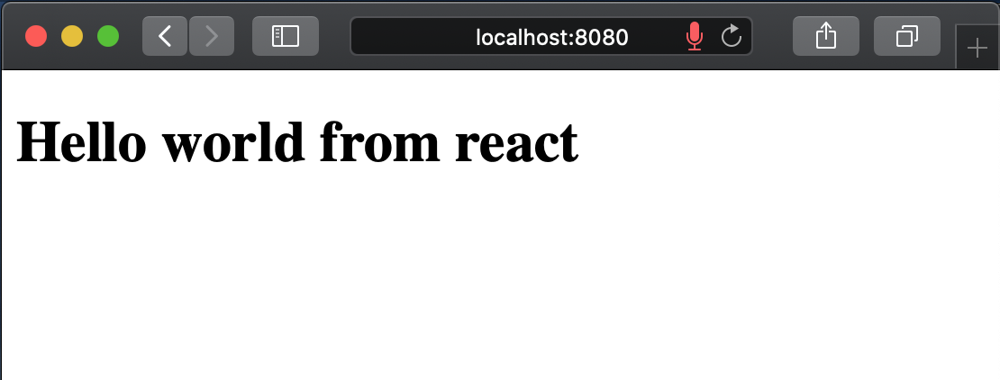
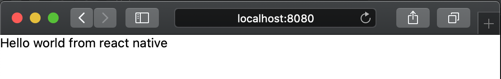
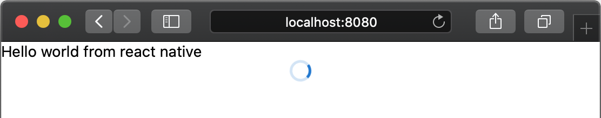

# Step 2: Setting up React with React-Native-Web

## In our pursuit of creating the ultimate UI development starting point, it is time to take the first step with react-native-web


> This is the second part of a series where I go through all the steps of creating [The Ultimate React Native UI Library starter repo](https://dev.to/ugglr/series-the-ultimate-react-native-ui-library-starter-repo-bho). Please visit the first post (just linked 👆🏻) for a general description of what we are trying to acomplish abd where all the Steps are numbered + linked. 

> The finished source code can be found here [react-native-storybook-boilerplate](https://github.com/ugglr/react-native-storybook-boilerplate)


What's covered in this post? -> 
- setting up react from scratch
  - installation
  - webpack
  - babel
- setting up react-native-web
  - installation
  - webpack alias configuration


_Please note that this is not a webpack or babel tutorial so I will more or less not cover the basics of those_

If you want to go really in depth in how to set up React from scratch I really recommend a tutorial series from [codecademy](https://www.codecademy.com):
- [React Setup Part 1: React and ReactDOM](https://www.codecademy.com/articles/react-setup-i)
- [React Setup Part 2: Babel](https://www.codecademy.com/articles/react-setup-ii)
- [React Setup Part 3: Webpack](https://www.codecademy.com/articles/react-setup-iii)
- [React Setup Part 4: HTMLWebpackPlugin](https://www.codecademy.com/articles/react-setup-iv)
- [React Setup Part 5: Conclusion](https://www.codecademy.com/articles/react-setup-v)
  
I thought that series was very good.


## Setting up React - Installing our dependencies

If you are following along from the first part in the series you have a "normal" `react-native` and `storbook` already set up and running locally, and now it's time to add `React` into the mix. 

**installation**

Obviously we need react, but it comes with the react-native installation but we need to add `react-dom` ->
```
yarn add react-dom
```
and then we need to install our babel dependencies babel
```
yarn add --dev @babel/core babel-loader @babel/preset-react @babel/preset-env
```
Then we also need to ochestrate the packaging so let's install webpack also while we are at it:
```
yarn add --dev webpack webpack-cli webpack-dev-server html-webpack-plugin
```

## Add scripts to package.json

You can do this in any order you like but, I for some reason, like to add scripts first. I think it gives me a sense of what I'm trying to acomplish. 

```json
"scripts": {
  ...
  "build-react": "webpack --mode production",
  "start-react": "webpack-dev-server --config ./webpack.config.js --mode development",
  ...
}
```

You obviously can name the scripts anything you like & makes sense to you: I named my scripts `start-react` & `build-react`.

## Configure Webpack

This is where the magic happens 🤹🏻‍♀️ In the root folder add a `webpack.config.js` file and add the folowing:

```js
const path = require('path')
const HTMLWebpackPlugin = require('html-webpack-plugin')

const HTMLWebpackPluginConfig = new HTMLWebpackPlugin({
  template: path.resolve(__dirname, './public/index.html'),
  filename: 'index.html',
  inject: 'body',
})

module.exports = {
  entry: path.join(__dirname, 'index.web.js'),
  output: {
    filename: 'bundle.js',
    path: path.join(__dirname, '/build'),
  },
  module: {
    rules: [
      {
        test: /\.js$/,
        exclude: /node_modules\/(?!()\/).*/,
        use: {
          loader: 'babel-loader',
          options: {
            presets: ['@babel/preset-env', '@babel/preset-react'],
          },
        },
      },
    ],
  },
  plugins: [HTMLWebpackPluginConfig],
  devServer: {
    historyApiFallback: true,
    contentBase: './',
    hot: true,
  },
}
```

_for a better description of what's going on I really recommend this article from `codecademy` [React Setup, Part III: Webpack](https://www.codecademy.com/articles/react-setup-iii)_

Here's a rough description:

| entry  | what it does                                                                                                                                                                                                                                      |
| ------ | ------------------------------------------------------------------------------------------------------------------------------------------------------------------------------------------------------------------------------------------------- |
| entry  | Tells Webpack the root file of our application. Starting from that file it will go through the whole tree and transform all code which match our webpack rules. I've named this file `index.web.js` we need to remember to create this file.      |
| output | Configuration for the output files from react. `filename` gives the packed javascript a name. `path` sets an output folder for the packed files                                                                                                   |
| rules  | `test` is a regular expression which matches to our source files, i.e. `*.js`. `exclude` excludes files we don't want webpack to touch. `use` this is where we plug in `babel` i.e. the stuff that will transform our react code into vanilla js. |

After webpack are dont with the JS it needs to make a new HTML file as well, that's where `HTMLWebpackPluginConfig` comes in, please refer to this article for a better description: [React Setup, Part IV: HTMLWebpackPlugin](https://www.codecademy.com/articles/react-setup-iv).  

Let's take a look at the code for the `HTMLWebpackPlugin` closer:

```js
const HTMLWebpackPluginConfig = new HTMLWebpackPlugin({
  template: path.resolve(__dirname, './public/index.html'),
  filename: 'index.html',
  inject: 'body',
})
```

- `template`: It tells our plugin what template file it should use and copy to our `./build` folder. I set it to a file in the folder `public` and the file name is `index.html`. (We shall not forget to create these.)
- `filename`: Is the name of the newly created file which it copies. As I mentioned above this file will wind up in `./build` folder. 
- `inject`: Is where the our JavaScript script tag will be injected. Both `head` and `body` are valid options. 

**What's the `path` stuff?**
It's just a way to concatenate path-strings instead of using a `+`sign, `__dirname` meaning the current directory which the file is in. 

## Add entry files

### Add public `index.html`

As I've configured the `HTMLWebpackPlugin`, and shortly explained right above, we need to add a `index.html` into a folder called `public`,

So! In `root` create a folder called `public` and inside of that folder create a file called `index.html` and the following `html`

```html
<!DOCTYPE html>
<html>
  <head>
    <title>React Native Web Storybook</title>
  </head>
  <body>
    <div id="app"></div>
  </body>
</html>
```

Take notice of the `id`-name (`app`) of the div where we are injecting the react single page application. All of these files are `react` boilerplate which are basically the same when using the library.

### Add index.web.js

In the root add `index.web.js` and code the following:

```js
import React from 'react'
import ReactDOM from 'react-dom'

import App from './App.web'

ReactDOM.render(<App />, document.getElementById('app'))
```

_this is where `<div id="app"></div>` needs to match `document.getElementById('app')`_

If you've used `create-react-app` before you'll see that it's basically the same code as they generate for you, in our case I wan't to keep `web react` seperate from `react-native` so I named the file with the extension `.web.js`.

From the code we also see that we need to add our `<App />` component, so let's do that next:

### Add App.web.js

In the root add `App.web.js`, this will be the entry component for react, and add the following code:

```js
import React from 'react'

function App() {
  return (
    <>
      <h1>Hello world from react</h1>
    </>
  )
}

export default App
```

As you can see this is normal jsx, we will come to adding `react-native-web` after we confirm that our `vanilla react` setup works first.

## Test our React configuration

It's time to check if we are able to run everything together so let's run our script:

```
yarn start-react
```

Hopefully this starts the Webpack development server for you and you see this page:



### Great Success Time to add React-Native-Web into the configuration!

## Install React-Native-Web

For those who are not quite familiar `react-native-web` makes it possible to use the `react-native-api` to write components for the web. It transforms `View` to `div` etc. so it's readable by a web browser. Really cool stuff!

>"React Native for Web" makes it possible to run React Native components and APIs on the web using React DOM.

It's open source and do check it out!
[react-native-web](https://github.com/necolas/react-native-web)

### Installation

```
yarn add react-native-web
```

When that's done we need to modify our `webpack` configuration so it swaps out all our `react-native` imports for `react-native-web`.

### Re-configure webpack.config.js

so it our awesome webpack file let's add the following lines:

```js
module.exports = {
  ...
  resolve: {
    alias: {
      'react-native$': 'react-native-web',
    },
  },
  ...
}
```

That's enough configuration for now!

Let's modify our `App.web.js` to use the `react-native-api`.

```js
import React from 'react';
import {View, Text} from 'react-native';

function App() {
  return (
    <View>
      <Text>Hello world from react native</Text>
    </View>
  );
}

export default App;
```

run yet again:

```
yarn start-react
```

and BEHOLD!



With this we can now use the whole `react-native`-api for the web, you can have a look here: [React-Native: Core Components and APIs](https://reactnative.dev/docs/components-and-apis)

To extra check this we can, for instance, add an `<ActivityIndicator />` component to our `App.web.js`

```js
import React from 'react';
import {View, Text, ActivityIndicator} from 'react-native';

function App() {
  return (
    <View>
      <Text>Hello world from react native</Text>
      <ActivityIndicator />
    </View>
  );
}

export default App;
```

And here's the result!



## That's it for this part in the series!

Thanks for reading and again, you can find the finished project here: [react-native-storybook-boilerplate](https://github.com/ugglr/react-native-storybook-boilerplate)